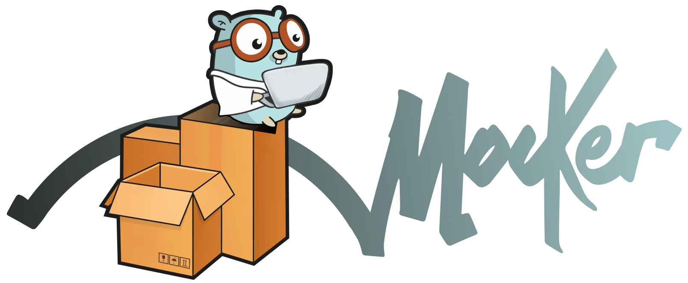

<p align="center">
  
</p>


[](https://codecov.io/gh/LastSprint/mocker)
[](https://goreportcard.com/report/github.com/LastSprint/mocker)

# `Mocker` это очень простой веб-сервер который может эмулирвать поведение настоящего бэкнда.

# Фичи

- URL-Query prams matching - выбирает мок в ависмиости от query параметров в запросе и в моке. 
- JSON-Body prams matching - выбирает мок в зависимости от JSON-тела  в запросе и в моке. 
- Caching Proxy - может проксировать запросы клиента на реальный бэк, записывать результат в мок и возвращать его клиенту
- Отключение определенного мока или всех моков кроме одного
- Задержка ответа для конкретного мока

## Что не поддерживается и вряд ли когда-то будет поддержано

Реляция моков. То есть моки это просто файлы и они не как не связаны между собой. И ни как не изменяется самим `Mocker`-ом.

Мы не хоитмэто поддерживать, потому что это очень сильно усложняет сам сервис и не дает особых плюсов. Потому что если вы пишите что-то на моках, то согласованность данных вам вряд ли необходима. 

А если вдруг вы кушать не можете - нужна реляция, то ее можно добиться с помощью матчинга query или body параметров. 

# Принцип работы

Принцип работы прост:
- Пользователи пишут моки. Мок описывает что `Mocker` должен вернуть в ответ на запрос.
- `Mocker` читает данные вов ремя старта либо после запрос `GET /update_models` (ниже будет описано как делать это автоматически)
- Когда `Mocker` получает запрос он находит подходящий мок и возвращет его клиенту. 

Однако под капотом все немного сложнее (:

## Моки

Моковые файлы представляют из себя `Json` формата:
```
 {
    "isDisabled": bool,
    "isOnly": bool,
    "isExcludedFromIteration": bool,
    "url": string,
    "method": string,
    "statusCode": int,
    "responseDelay": int,
    "response": object,
    "request": object
    "responseHeaders": object
    "requestHeaders": {
        "key": "value",
         .....
     }
 }
```

Буквально здесь записано следующее:

На запрос с `URL = url` и `Method = method` вернуть ответ `response` с кодом `statusCode`

### `url`

Может быть следующих видов:

#### `/path/to/endpoint` 
бычный URL. Во время получения запроса сервис будет сравнивать строки посимвольно.

#### `/path/to/endpoint/{number}`

URL с path-паттерном. Мок с таким URL будет реагировать на любой запрос который удовлетворяет этому шаблону.

Например:
```
/path/to/endpoint/1 --> OK
/path/to/endpoint/item --> OK
/path/to/endpoint/1/2 --> FALSE
```

#### `/path/to/endpoint/data?param={value}`

URL c query-паттерном. Мок с таким URL сработает на запрос, содержащий заданные параметры. При этом, если одного из параметров не будет в запросе, то он не сматчится с шаблоном.

**ВНИМАНИЕ**

URL должен начинатья с `/`

### `method`

Пишите названия HTTP методов в UpperCase. 

**НЕ** `get` **А**  `GET` 

### `statusCode`

Любое целое число. Желательно из известных [HTTP-кодов](https://ru.wikipedia.org/wiki/Список_кодов_состояния_HTTP)

### `response`

Это поле содержит `Json`, который вернется в ответ на запрос. 

### `request`

Это поле содержит данные для поиска конкретного мока. 

При этом для этого поля работает парамтеризация.

Допустим мы хотим замокать процесс оформления заказа:

```JSON
{
  "url": "/billing/create",
  "method": "POST",
  "request": {
    "shopId": "123",
    "paymentType": "card",
    "items": []
  },
  "statusCode": 200,
  "response": {
    "orderId": 123
  }
}
```

Тогда на запрос оформления заказа из магазина `123` при оплате по карте всегда будет отдан мок выше. 

Но есть загвоздка. Такой мок будет сматчен с запросом тольков  том случае, если в запросе массив `items` пуст. То есть для каждой корзины (с разными товарами) придется задвать новый мок. 

Чтоб это обойти обновим мок:

```JSON
{
  "url": "/billing/create",
  "method": "POST",
  "request": {
    "shopId": "123",
    "paymentType": "card",
    "items": "{items}"
  },
  "statusCode": 200,
  "response": {
    "orderId": 123
  }
}
```

Теперь этот мок будет возвращаться вне зависимости от значения `items`

А теперь мы хотим, чтоб на запрос, способ оплаты которого не равен `card` возвращалась ошибка. 

```JSON
{
  "url": "/billing/create",
  "method": "POST",
  "request": {
    "shopId": "123",
    "paymentType": "{ paymentType != card }",
    "items": "{items}"
  },
  "statusCode": 400,
  "response": {
    "msg": "Current paymentType is unsupported"
  }
}
```

#### Шаблоны

- `{value}` - шаблон описывающий любое значение
- `{value != | > | < | >= | <=  $const$ }` - шаблон с выражением. Через `|` перечислены поддерживаемые операторы.

Операторы работают для ограниченного набора типов:
- `!=` для `String, Int, Dobule`
- `>`, `<`, `>=`, `<=` для `Int, Dobule`

Если вы указали шаблон с выражением, то:
- Если тип данных в `request` не может быть использован в этом операторе мок **не сматчится**
- Если значение `$const$` не может быть приведено к типу данных в `request` мок **не сматчится**

Подробнее можно прочесть [здесь](/docks/features.md/#cравнение-по-параметрам)

### RequestHeaders

Это поле содержит данные для поиска конкретного мока

Подробнее [тут](/docks/features.md/#сравнение-по-заголовкам)

### ResponseHeaders

Содержит список пар ключ-значение где ключ - имя хедера, а value - значение. 

Например, если мы хотим чтоб мокер вернул заголово `X-Example-Header` со значением `example_value` то пишем: 

```Json
"responseHeaders": {
  "X-Example-Header": "example_value"
}
```

### IsDisabled

Флаг, который может перевести мок в состояние "выключен". В случае, если значение `isDisabled == true`, то мок не будет участвовать в выдаче. 

В случае, если значение `false` или `nil`, то поведение стандартное.

### IsOnly

Флаг, который отключает все моки, кроме одного конкретного. Если для какого-то мока `IsOnly == true`, то в выдаче будет учавствовать ТОЛЬКО этот мок. Все остальные будут считаться "выключеными". 

В случае, если для мока одновременно `IsOnly == true` и `IsDisabled == true`, то значение `IsDisabled` игнорируется. 

В случае, если `IsOnly == true` одновременно для нескольких моков, то ВСЕГДА будет отдаваться ПЕРВЫЙ по порядку мок. Никакого итерирования (пока во всяком случае) нет. 

При этом, счетчик итератора не сбрасывается. То есть если итератор указывал на n-й файл, то после включения и отключения `IsOnly` итератор все так же будет указывать на n-й мок.

### ResponseDelay

Это поле нужно для того, чтобы специально замедлить ответ сервера с конкретным моком. То есть все моки, у которых значение этого поля != 0 будут замедляться на указанное время. Время измеряется в секундах. 

### IsExcludedFromIteration

Это поле используется для того, чтобы исключить мок из итеративных ответов. Пример использования: когда у вас есть мок с заданным телом запроса и вы хоитте чтоб он возвращался только в том случае, когда в запросе пришло именно это тело. 
 
По-умолчанию: `false`
 
## Конфигурация

Приложение имеет конфиг в `Json` следующего формата:
```
{
    "mocksRootDir": string,
    "port": int,
    "logPath": string
}
```

### Mocks Root Dir

Это путь до папки, которая является корневой для файлов с моками. 

### Port

TCP-порт, который будет слушать приложение

### Log Path

Путь до файла с логами. Туда приложение будет писать логи работы.

## Docker

Чтобы запустить сервис с web-ui через докер нужно выполнить:

```
cd docker
docker-compose -p mocker --no-cache up
```
